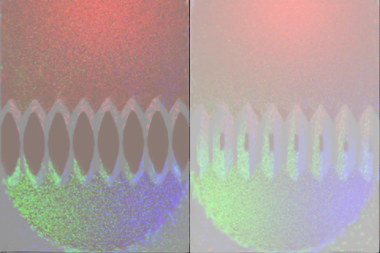
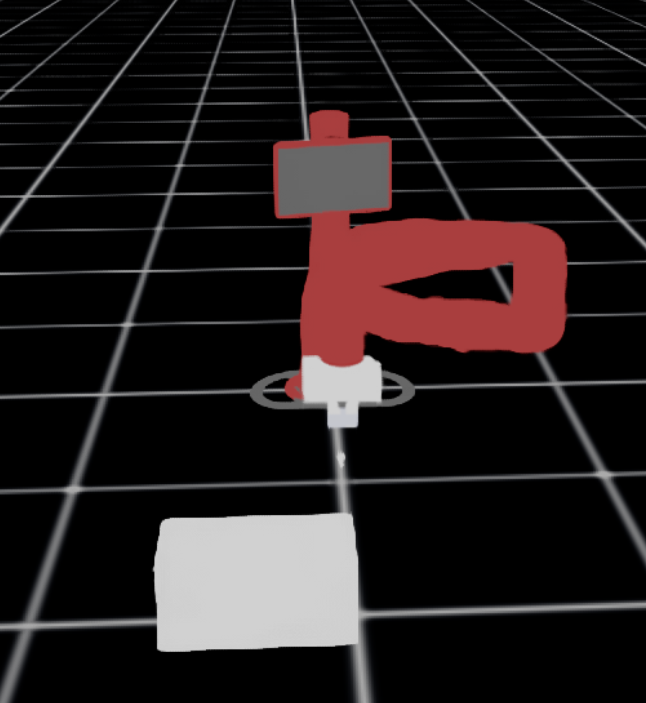

# Digit Robot Simulation in Isaac Lab 4.5

Welcome to this Isaac Lab simulation based on the [TactSim-IsaacLab](https://github.com/yuanqing-ai/TactSim-IsaacLab) project. This repository adapts and extends their work to run smoothly on **Ubuntu 22.04** with **Isaac Lab 4.5**.

This simulation features a robot hand equipped with fingertip cameras, interacting with objects like bolts and boxes in a simulated scene. It's designed to provide visual feedback from the robot's perspective and allow experimentation with manipulation and IK control.

---

## ✅ Requirements

Before continuing, please make sure you have:

1. Carefully read and understood the setup in [TactSim-IsaacLab](https://github.com/yuanqing-ai/TactSim-IsaacLab)
2. Completed a **full install of Isaac Lab 4.5** by following the official instructions:  
   👉 https://isaac-sim.github.io/IsaacLab/main/index.html

> ⚠️ This repo assumes you're familiar with the TactSim project and that Isaac Lab is correctly installed.

---

## 🚀 Running the Simulation

In a terminal at the root of this repo:

```bash
conda activate env_isaaclab
<path-to-IsaacLab>/IsaacLab/isaaclab.sh -p demo_bolt.py --enable_cameras
```

This will launch the simulation with:
- A digit robot
- Bolt and box objects
- Cameras on the fingertips
- Real-time RGB streams and gripper control using differential IK

---

## 🖼️ Example Output

> Insert image of the fingertip camera view here.



> Full simulation scene here.



---

## 🛠️ Features

- 💡 Fully configured scene with dome lights and ground
- 🖐️ Digit robot with active fingertip cameras
- 🧲 Object interaction with a bolt
- 🎮 Differential IK controller for manipulation
- 🎥 Real-time RGB camera visualization using OpenCV

---

## 🔭 Future Work

This is just the beginning! Future updates will include:
- Support for additional objects to interact with and grip
- New robot arms beyond the Digit hand
- More dynamic scenes and sensor configurations
- Improve image procesing of the sensors

Stay tuned for updates 👀

---

## 🤝 Contributing

Pull requests are welcome! Feel free to open issues or submit improvements.

If you try it and run into any trouble, I'd love to hear about it!

---

## 📄 License

Please refer to the LICENSE file for usage rights and conditions.

